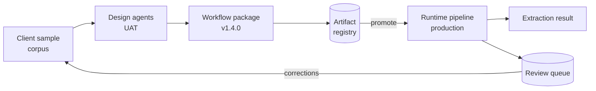
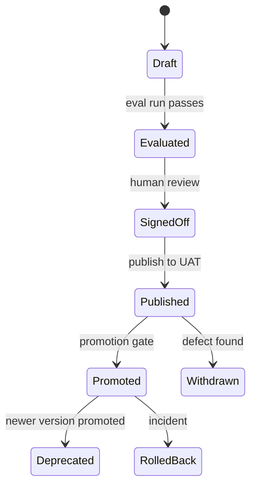

# DataExtractor PRD — Shared Contracts & Artifact Store

2026-09-20 · Joe

Every design-time artifact and every runtime output in DataExtractor is defined here: one versioned **workflow package** per client is the only thing design-time produces and the only thing runtime loads, so this contract is the seam between the two environments and must be agreed before either side is built.

This is PRD 1 of 3. PRD 2 covers design-time activities, PRD 3 covers runtime activities. Requirement IDs in this document use the prefix `CTR-`; design-time uses `DT-` and runtime uses `RT-`.

## Scope and environment model

DataExtractor runs as two environments over one shared contract: a design-time environment that authors a client's extraction behaviour, and a runtime environment that executes it on live email. Nothing is hard-coded per client in runtime code — behaviour travels only as artifacts inside a workflow package.

| Environment | Where | Owns | Produces | Consumes |
| --- | --- | --- | --- | --- |
| Design-time | AWS UAT account (Phase 1: local) | Workflow authoring, artifact generation, evaluation, sign-off | Workflow package v`x.y.z` | Client sample corpus, existing package |
| Runtime | AWS production account | Live extraction on inbound email | Extraction result, review queue entry, audit record | Workflow package v`x.y.z` (read-only) |

The seam is deliberately narrow. Runtime never calls a design-time service and never writes to the artifact registry; design-time never touches production email. The only object crossing the boundary is a promoted, immutable workflow package.



Corrections made by human reviewers in production flow back only as new corpus entries for the next design-time cycle. Runtime does not self-modify artifacts.

**In scope for this PRD:** the workflow package format, the four design-time artifact schemas, the three runtime output contracts, the artifact registry, versioning and the promotion gate.

**Out of scope:** how artifacts are generated (PRD 2), how they are executed (PRD 3), email ingress, IAM and account topology.

## The workflow package

A workflow package is one client's complete extraction behaviour for one use case, addressed as `client_id/workflow_id@version`. It is a single immutable bundle; there is no partial update and no artifact that lives outside a package.

```
acme/ap-invoices@1.4.0/
  manifest.json            # identity, version, engine range, artifact index, checksums
  schemas/
    invoice.json           # one field schema per email type in scope
    remittance.json
  rules/
    detection.json         # signal keywords, regex patterns, entity weights
  skills/
    field-mapping.md       # skill body (prompt text)
    field-mapping.json     # skill manifest (binding, inputs, outputs, tools)
    sheet-selection.md
    sheet-selection.json
  thresholds.json          # per-type accept / review / reject bands
  eval/
    report.json            # design-time evaluation result at this version
```

| ID | Requirement | Acceptance criteria |
| --- | --- | --- |
| CTR-01 | A workflow package is uniquely identified by `client_id`, `workflow_id` and a semver `version`, and is immutable once published. | A second publish to an existing `client_id/workflow_id@version` is rejected with `409 version_exists`; bytes at a published version never change. |
| CTR-02 | Every package carries a `manifest.json` conforming to the manifest schema, listing every artifact file with a SHA-256 checksum. | Loader recomputes each checksum on load; any mismatch fails the load with `package_corrupt` and the package is not used. |
| CTR-03 | The manifest declares `engine_range` (semver range of runtime engine versions it is valid for). | A runtime engine outside the range refuses the package with `engine_incompatible` rather than loading it partially. |
| CTR-04 | A package is self-contained: no artifact may reference a file outside its own package. | Static validation at publish rejects any cross-package or absolute path reference. |
| CTR-05 | A package declares the set of email types it covers; each declared type has exactly one field schema and one threshold entry. | Publish validation fails with `type_incomplete` naming the missing artifact. |

### manifest.json

```json
{
  "client_id": "acme",
  "workflow_id": "ap-invoices",
  "version": "1.4.0",
  "engine_range": ">=2.1.0 <3.0.0",
  "email_types": ["invoice", "remittance"],
  "created_at": "2026-09-18T11:04:22Z",
  "created_by": "design-agent:field-schema@0.9.2",
  "source_corpus_id": "acme/corpus/2026-09-01",
  "artifacts": [
    { "path": "schemas/invoice.json", "kind": "field_schema", "sha256": "9f2c…" },
    { "path": "rules/detection.json", "kind": "detection_rules", "sha256": "41ab…" },
    { "path": "skills/field-mapping.json", "kind": "skill_manifest", "sha256": "c70d…" },
    { "path": "thresholds.json", "kind": "thresholds", "sha256": "bb18…" }
  ],
  "eval": { "report": "eval/report.json", "corpus_size": 412, "field_accuracy": 0.943 }
}
```

## Artifact schemas

Four artifact kinds carry all per-client behaviour. Each has a JSON Schema published alongside the engine; design-time validates on write, runtime validates on load, and both use the same schema file.

| ID | Requirement | Acceptance criteria |
| --- | --- | --- |
| CTR-06 | Every artifact carries `schema_version`; the loader resolves it against the engine's supported set. | An artifact with an unsupported `schema_version` fails the load with `schema_unsupported`; it is never coerced. |
| CTR-07 | Field schema defines, per email type, required fields, optional fields, canonical type, and validation rules. | The Field Schema Lookup Tool (RT) returns required + optional + validation for any declared type without further lookup. |
| CTR-08 | Detection rules define signal keywords, regex patterns and entity weights per email type, with a per-type classification threshold. | Signal Detection Skill produces a type and a score using only this artifact and its declared tools. |
| CTR-09 | A skill manifest binds a skill body to the agents that may invoke it, the tools it may call, and its input/output shape. | Runtime refuses to invoke a skill from an agent not listed in `bound_agents`, and refuses a tool call not listed in `tools`. |
| CTR-10 | Thresholds define, per email type, the accept band, review band and per-field critical tolerances. | Flag Router routes on these values alone; changing a threshold requires no code change and no redeploy. |
| CTR-11 | Every artifact records `generated_by` (design agent + version) and `reviewed_by` (human sign-off identity) or is marked `unreviewed`. | An `unreviewed` artifact cannot be promoted to production (see CTR-19). |

### Field schema

```json
{
  "schema_version": "1.0",
  "email_type": "invoice",
  "required_fields": [
    { "name": "vendor",   "type": "string",  "critical": false },
    { "name": "amount",   "type": "decimal", "critical": true,
      "validation": { "min": 0, "currency_required": true } },
    { "name": "due_date", "type": "date",    "critical": true,
      "validation": { "format": "ISO-8601", "not_before": "issue_date" } },
    { "name": "invoice_number", "type": "string", "critical": true,
      "validation": { "pattern": "^[A-Z0-9-]{4,20}$" } }
  ],
  "optional_fields": [
    { "name": "po_number", "type": "string" },
    { "name": "tax_amount", "type": "decimal" }
  ],
  "aliases": {
    "amount": ["Total Due", "Amount Payable", "Grand Total", "Balance Due"],
    "due_date": ["Payment Due", "Due By", "Net Terms Date"]
  },
  "generated_by": "design-agent:field-schema@0.9.2",
  "reviewed_by": "joe@acme.example"
}
```

`aliases` is the design-time-generated input to the runtime Field Mapping Skill. The skill still applies judgment; the alias list is evidence, not a lookup table.

### Detection rules

```json
{
  "schema_version": "1.0",
  "types": {
    "invoice": {
      "keywords": [
        { "term": "invoice", "weight": 0.45 },
        { "term": "amount due", "weight": 0.30 },
        { "term": "remit to", "weight": 0.20 }
      ],
      "patterns": [
        { "name": "invoice_no", "regex": "(?i)inv(oice)?[ #:-]{0,3}([A-Z0-9-]{4,20})", "weight": 0.35 }
      ],
      "entity_weights": { "MONEY": 0.25, "DATE": 0.10, "ORG": 0.10 },
      "classification_threshold": 0.60,
      "negative_signals": ["quotation", "proforma", "statement of account"]
    }
  },
  "generated_by": "design-agent:detection-rules@0.9.2"
}
```

### Skill manifest

```json
{
  "schema_version": "1.0",
  "skill_id": "field-mapping",
  "version": "1.2.0",
  "body": "skills/field-mapping.md",
  "bound_agents": ["csv_parser", "spreadsheet_parser"],
  "tools": ["csv_reader", "spreadsheet_reader", "field_schema_lookup"],
  "inputs":  { "columns": "string[]", "sample_rows": "row[]", "email_type": "string" },
  "outputs": { "mapping": "map<source_column, canonical_field>",
               "unmapped": "string[]",
               "per_field_confidence": "map<canonical_field, float>" },
  "token_budget": 4000,
  "timeout_ms": 20000,
  "generated_by": "design-agent:skill-author@0.9.2",
  "reviewed_by": "joe@acme.example"
}
```

The seven runtime skills named in the architecture — Entity Extraction, Sheet Selection, Field Mapping, Confidence Scoring, Conflict Resolution, Key Search, Signal Detection — each ship as a manifest plus a body. A package may override any of them; unoverridden skills fall back to the engine's default body, recorded in the audit record as `skill_source: default`.

### Thresholds

```json
{
  "schema_version": "1.0",
  "types": {
    "invoice": {
      "accept_at": 0.85,
      "review_below": 0.85,
      "reject_below": 0.40,
      "required_field_coverage": 1.0,
      "critical_field_tolerance": {
        "amount": { "absolute": 0.01 },
        "due_date": { "days": 0 }
      },
      "always_review_if": ["encrypted_no_key", "attachment_parse_failed", "embedded_depth_exceeded"]
    }
  },
  "generated_by": "design-agent:threshold-tuner@0.9.2",
  "reviewed_by": "joe@acme.example"
}
```

## Runtime data contracts

Runtime emits exactly three objects per run: one terminal object (extraction result **or** review queue entry) and one audit record, always. All three share `audit_id` and `package_version`, which is what makes a production result reproducible against the design-time artifacts that produced it.

| ID | Requirement | Acceptance criteria |
| --- | --- | --- |
| CTR-12 | Every extracted value is `{value, source, confidence}`; no bare values appear in any output. | Schema validation rejects a field whose value is a scalar rather than the triple. |
| CTR-13 | `source` identifies origin precisely enough to re-open it: `body:segment_<n>`, `attachment:<filename>#<locator>`, or `embedded:<depth>:<path>`. | A reviewer can locate any field's origin from the source string alone, without the audit log. |
| CTR-14 | Every run emits exactly one terminal object and exactly one audit record, sharing `audit_id`. | Reconciliation job finds zero audit records without a terminal object and zero terminal objects without an audit record. |
| CTR-15 | Every terminal object records `package_version` and the engine version that executed it. | Given a result, the exact artifact bytes that produced it can be retrieved from the registry. |
| CTR-16 | Review queue entries carry machine-readable `review_reason` codes from a closed vocabulary, never free text. | Every code emitted by runtime exists in the reason-code enum; unknown codes fail CI. |

### Extraction result

```json
{
  "audit_id": "run_abc123",
  "client_id": "acme",
  "workflow_id": "ap-invoices",
  "package_version": "1.4.0",
  "engine_version": "2.1.3",
  "type": "invoice",
  "confidence": 0.91,
  "fields": {
    "vendor":   { "value": "Acme Corp",  "source": "attachment:invoice.pdf#p1",   "confidence": 0.97 },
    "amount":   { "value": 12400.00,     "source": "body:segment_0",              "confidence": 0.88 },
    "due_date": { "value": "2026-09-15", "source": "attachment:invoice.pdf#p1",   "confidence": 0.95 }
  },
  "completed_at": "2026-09-20T09:12:44Z"
}
```

### Review queue entry

```json
{
  "audit_id": "run_abc123",
  "client_id": "acme",
  "workflow_id": "ap-invoices",
  "package_version": "1.4.0",
  "type": "invoice",
  "confidence": 0.61,
  "partial_fields": { "vendor": { "value": "Acme Corp", "source": "body:segment_1", "confidence": 0.72 } },
  "review_reason": ["encrypted_no_key", "missing_field:due_date"],
  "raw_sources": ["body", "attachment:locked.pdf"],
  "queued_at": "2026-09-20T09:12:44Z"
}
```

**Reason-code vocabulary (v1):** `low_confidence`, `missing_field:<name>`, `critical_field_conflict:<name>`, `encrypted_no_key`, `attachment_parse_failed:<filename>`, `unsupported_attachment:<mime>`, `embedded_depth_exceeded`, `classification_ambiguous`, `agent_timeout:<agent>`, `agent_failed:<agent>`, `schema_validation_failed:<name>`.

### Audit record

```json
{
  "audit_id": "run_abc123",
  "package_version": "1.4.0",
  "engine_version": "2.1.3",
  "received_at": "2026-09-20T09:12:31Z",
  "outcome": "review_queued",
  "agent_trace": [
    { "agent": "ingestion",        "started_ms": 0,    "duration_ms": 42,   "status": "ok" },
    { "agent": "signal_detection", "started_ms": 42,   "duration_ms": 610,  "status": "ok",
      "skill": "signal-detection@1.0.0", "skill_source": "package", "output": { "type": "invoice", "score": 0.74 } },
    { "agent": "encryption",       "started_ms": 660,  "duration_ms": 120,  "status": "flagged",
      "reason": "encrypted_no_key" }
  ],
  "field_attribution": [
    { "field": "vendor", "value": "Acme Corp", "source": "body:segment_1",
      "produced_by": "body_parser", "skill": "entity-extraction@1.1.0", "confidence": 0.72 }
  ],
  "retries": [{ "agent": "spreadsheet_parser", "attempts": 2, "final_status": "ok" }]
}
```

The audit record is append-only and written even when the run fails hard; a run that crashes emits an audit record with `outcome: "error"` and the trace up to the failure.

## Registry, versioning and promotion

The artifact registry is the single store of workflow packages. Design-time writes to the UAT channel; promotion copies a package to the production channel unchanged; runtime reads the production channel only.



| ID | Requirement | Acceptance criteria |
| --- | --- | --- |
| CTR-17 | Versions follow semver with defined meanings: patch = threshold or alias change only; minor = new field, new skill, new type; major = breaking field removal or rename. | Publish validation compares against the previous version and rejects a bump that understates the change (`version_bump_insufficient`). |
| CTR-18 | A package is promoted, never rebuilt: production bytes are byte-identical to the UAT package that passed evaluation. | Checksum comparison between UAT and production copies matches for every artifact at promotion and on demand thereafter. |
| CTR-19 | Promotion requires a passing evaluation report and a recorded human sign-off; `unreviewed` artifacts block promotion. | Promotion API returns `403 signoff_required` when either is absent; the attempt is logged. |
| CTR-20 | Exactly one package version per `client_id/workflow_id` is `active` in production at a time; the previous version stays resident for rollback. | Activation is atomic; rollback to the previous version completes without a redeploy and is verified in UAT quarterly. |
| CTR-21 | The registry records who promoted what, when, and against which evaluation report, immutably. | Promotion history for any workflow is queryable for the retention period and cannot be edited or deleted. |
| CTR-22 | In-flight runs complete against the package version they started with. | A version switch during a run does not change that run's `package_version`; the audit record proves it. |

**Rollback.** Runtime resolves `client_id/workflow_id` to an active version at run start. Rollback is a pointer change to the previously promoted version, and takes effect for runs starting after the change. Target: active within five minutes of a decision, with no engine deployment.

## Non-functional requirements

| ID | Requirement | Target |
| --- | --- | --- |
| CTR-23 | Package load latency at runtime, cold | ≤ 500 ms for a package up to 2 MB, including checksum verification |
| CTR-24 | Package load latency, warm | ≤ 5 ms; packages cached in-process, keyed by `client_id/workflow_id@version` |
| CTR-25 | Package size ceiling | 10 MB total; a package exceeding it is rejected at publish |
| CTR-26 | Schema backward compatibility | The engine supports the current and previous `schema_version` of every artifact kind for at least two minor engine releases |
| CTR-27 | Artifact store encryption | Encrypted at rest with a customer-scoped key; access per client, no cross-client read path |
| CTR-28 | No client data in artifacts | Artifacts carry patterns, aliases and thresholds, never source email content or PII from the corpus; publish validation scans for email addresses, account numbers and long literal strings from the corpus |
| CTR-29 | Audit record retention | 7 years, immutable, queryable by `audit_id`, `client_id` and date range |
| CTR-30 | Review queue retention | 90 days after resolution, then archived with the audit record |
| CTR-31 | Contract test coverage | Every schema has a golden-file test pair (valid + invalid) in CI; the engine and the design module import the same schema files |

CTR-28 is the sharpest constraint on design-time: generated aliases and regex patterns must generalise, and a pattern that encodes a literal value from the sample corpus is a defect, not a rule.

## Phase 1 (PoC) scope

Phase 1 builds the contract layer in full but exercises only the parts the PoC needs: design agents running locally, CSV and Excel attachments, one client workflow.

| Contract element | Phase 1 | Deferred |
| --- | --- | --- |
| Workflow package layout and `manifest.json` | Built, with checksums | — |
| Field schema, detection rules, thresholds | Built and validated | — |
| Skill manifest | Built for Field Mapping and Sheet Selection only | Entity Extraction, Confidence Scoring, Conflict Resolution, Key Search, Signal Detection overrides |
| Extraction result, review queue entry, audit record | Built in full | — |
| Artifact registry | Local filesystem directory with the same layout and checksum rules | S3-backed registry, promotion API, activation pointer |
| Promotion gate (CTR-17 to CTR-22) | Specified, not implemented | Phase 2, with the UAT account |
| Encryption, retention (CTR-27, CTR-29, CTR-30) | Specified, not implemented | Phase 2 |

**Phase 1 acceptance criteria**

- [ ] A locally generated package for one client validates against every schema and loads into the runtime engine with checksums verified.
- [ ] A runtime execution over a CSV and an XLSX attachment emits a schema-valid extraction result, or a review queue entry with codes drawn from the v1 vocabulary.
- [ ] Every field in the result carries `{value, source, confidence}` with a source string that resolves to a real row or cell.
- [ ] The audit record for that run names the package version and the skill version used for each judgment step.
- [ ] Moving the local package directory to a second machine reproduces the same extraction result byte-for-byte on the same input.
- [ ] Golden-file contract tests pass in CI for all four artifact kinds and all three output contracts.

## Open questions

- [ ] **Package granularity.** One package per client per use case, or one package per client covering several use cases with a type-to-workflow router? The design assumption so far is a dedicated workflow per client/use case; this PRD follows it, but a client with five near-identical use cases will duplicate artifacts.
- [ ] **Skill body format.** Markdown prompt bodies are assumed. If skills will also carry executable pre/post-processing, the manifest needs a code reference and a sandbox contract.
- [ ] **Alias learning from production.** Should reviewer corrections auto-propose alias additions, or only appear as corpus entries for the next design cycle? Auto-proposal shortens the loop but blurs CTR-18.
- [ ] **Currency and locale.** Amount fields assume a single currency per email type. Multi-currency documents need either a `currency` sub-field on every amount or a per-type currency declaration.
- [ ] **Engine-default skills.** Confirm that a package with no skill overrides is valid, and that `skill_source: default` in the audit record is enough for traceability.
- [ ] **Registry backend.** S3 + DynamoDB pointer versus a package registry service. Decision needed before Phase 2, not before Phase 1.
