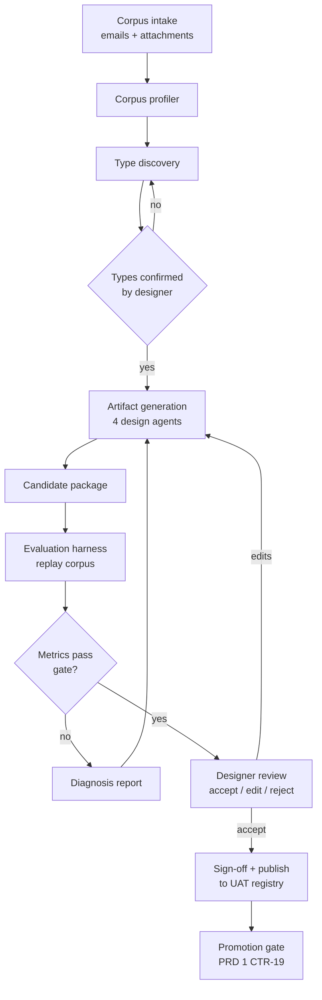

# DataExtractor PRD — Design-Time Activities

2026-09-20 · Joe

Design-time turns a client's sample email corpus into a signed-off, versioned workflow package — field schemas, detection rules, skills and thresholds — without anyone hand-writing a rule, so onboarding a new client or use case is an authoring run rather than an engineering change.

This is PRD 2 of 3. Contracts and artifact schemas referenced here (`CTR-` IDs) are defined in **DataExtractor PRD — Shared Contracts & Artifact Store**; runtime execution is PRD 3. Requirement IDs here use the prefix `DT-`.

## Scope, users and goals

Design-time is a supervised authoring system, not an autonomous one. Design agents propose artifacts; a human accepts, edits or rejects them; only accepted artifacts are published. The measure of success is how little hand-editing a proposal needs.

| User | Does | Needs from the system |
| --- | --- | --- |
| Workflow designer | Runs the authoring loop for a client, reviews proposals, signs off | Readable proposals, evidence for each one, side-by-side eval results, one-click re-run |
| Client SME | Supplies sample emails, confirms which fields matter and what the right answers are | A simple corpus format and a labelling surface that does not require engineering help |
| Platform engineer | Maintains design agents, schemas and the eval harness | Deterministic replays, versioned agent identities, cost visibility |

**Goals**

1. A new client use case reaches a promotable package from a labelled corpus without writing code.
2. Every artifact is traceable to the corpus evidence that produced it and the person who accepted it.
3. A re-design run on an updated corpus produces a diff against the current package, not a fresh guess.
4. Design-time cost and duration for one workflow are known and bounded before the run starts.

**Non-goals**

- Autonomous promotion to production. Sign-off is always human (CTR-19).
- Runtime execution or any production data access. Design-time reads only the client-supplied corpus.
- A general-purpose prompt IDE. The only editable objects are the four artifact kinds in CTR-06 to CTR-11.

## The design-time loop

One authoring run takes a labelled corpus to a candidate package and an evaluation report. The loop is re-entrant: a rejected proposal or a failed metric sends the run back to generation with the reviewer's correction as new evidence, not back to the start.



| ID | Requirement | Acceptance criteria |
| --- | --- | --- |
| DT-01 | An authoring run is a single addressable job with a `run_id`, a corpus reference, a starting package version (or none) and a terminal state. | Run state is queryable at any point; a crashed run resumes from its last completed stage rather than restarting. |
| DT-02 | Generation is incremental against an existing package: the output is a diff, with unchanged artifacts carried forward byte-identical. | Re-running on an unchanged corpus produces zero artifact changes and no version bump. |
| DT-03 | Every proposal carries the corpus evidence that produced it: sample ids, matched spans and counts. | A designer can open any proposed alias, pattern or threshold and see the emails behind it without leaving the review surface. |
| DT-04 | A rejected or edited proposal is fed back as a constraint on the next generation pass within the same run. | The same proposal is not re-offered unchanged after rejection; the run log records the constraint. |
| DT-05 | A run terminates in `published`, `abandoned` or `failed`; none of these states writes to the production channel. | Registry audit shows no production write originating from a design run. |

## Design agents

Eight agents, each owning one stage and at most one artifact kind. They are coordinated by a design orchestrator that mirrors the runtime orchestrator: shared working memory, explicit hand-offs, retries and a terminal state.

| Agent | Input | Output | Artifact kind |
| --- | --- | --- | --- |
| Corpus Profiler | Raw corpus | Per-sample inventory: attachment kinds, column headers, sheet names, encryption, thread depth | none (run memory) |
| Type Discovery | Profile + labels | Proposed email type list with sample counts and exemplars | none (proposal) |
| Field Schema Agent | Labelled samples per type | Required/optional fields, canonical types, validation rules, alias sets | `field_schema` |
| Detection Rules Agent | Labelled samples per type + negatives | Keywords with weights, regex patterns, entity weights, classification threshold, negative signals | `detection_rules` |
| Skill Author Agent | Profile + schema + failure cases | Skill body and manifest for the skills this client overrides | `skill_manifest` + body |
| Threshold Tuner | Eval predictions vs ground truth | Accept/review/reject bands and critical-field tolerances per type | `thresholds` |
| Evaluation Agent | Candidate package + held-out corpus | Metrics, per-field error breakdown, failure exemplars | `eval/report.json` |
| Packager | Accepted artifacts | Validated package with manifest, checksums, semver bump | package |

### Requirements

| ID | Requirement | Acceptance criteria |
| --- | --- | --- |
| DT-06 | Corpus Profiler enumerates every sample's attachments by magic-byte detection, records headers, sheet names and column labels, and flags encrypted or unreadable items before any generation runs. | A run over a 500-sample corpus produces a profile naming every attachment's detected type; unreadable items appear in the profile, not as a run failure. |
| DT-07 | Type Discovery proposes email types with a sample count and at least three exemplars each, and never proceeds past a designer confirmation step. | Generation cannot start until the type list is confirmed; the confirmed list becomes `email_types` in the manifest (CTR-05). |
| DT-08 | Field Schema Agent proposes a field only when it appears in a configurable minimum share of that type's samples (default 60%), and marks a field `critical` only on designer confirmation. | Every proposed field shows its observed frequency; no field is marked critical without an explicit accept. |
| DT-09 | Field Schema Agent proposes aliases from observed header and label variants across body and attachments, grouped by canonical field. | Each alias lists the samples it came from; aliases never contain values, only labels (supports CTR-28). |
| DT-10 | Detection Rules Agent generates keyword weights and regex patterns that generalise: no pattern may match fewer than a configurable minimum number of distinct samples (default 3). | Publish validation rejects a rule whose support is below the minimum, naming the rule. |
| DT-11 | Detection Rules Agent mines negative signals from samples labelled as other types or as out-of-scope. | The proposed `negative_signals` list is non-empty whenever the corpus contains at least one out-of-scope sample. |
| DT-12 | Skill Author Agent produces a skill override only where the default skill measurably underperforms on the corpus; otherwise the package inherits the engine default. | Each proposed override cites the default skill's error cases it is meant to fix, with before/after metrics from the eval harness. |
| DT-13 | Skill bodies are generated against the skill manifest contract (CTR-09): declared tools only, declared input/output shape only. | A generated skill body referencing an undeclared tool fails validation at publish. |
| DT-14 | Threshold Tuner derives bands from the confidence distribution of correct vs incorrect predictions on held-out samples, and reports the precision/recall trade-off at each candidate band. | The designer sees, for each proposed threshold, the share of corpus routed to review and the residual error rate above the band. |
| DT-15 | Packager assigns the semver bump from the artifact diff using the CTR-17 rules and refuses to publish an insufficient bump. | A field removal proposed as a patch bump is rejected before publish. |
| DT-16 | Every artifact records `generated_by` with the design agent id and version, and `reviewed_by` on acceptance (CTR-11). | No artifact reaches the UAT registry with both fields empty. |

## Corpus intake and labelling

A corpus is the only client input. Its quality sets the ceiling on everything design-time produces, so intake validates it before an authoring run may start.

```
acme/corpus/2026-09-01/
  samples/
    0001/  raw.eml   attachments/invoice.xlsx
    0002/  raw.eml   attachments/statement.csv
  labels.jsonl            # one ground-truth record per sample
  corpus.json             # id, client, date, sample count, provenance, consent note
```

```json
{ "sample_id": "0001",
  "email_type": "invoice",
  "in_scope": true,
  "fields": {
    "vendor": "Acme Corp",
    "amount": 12400.00,
    "due_date": "2026-09-15",
    "invoice_number": "INV-20194"
  },
  "field_sources": { "amount": "attachment:invoice.xlsx!Summary!B14" },
  "labelled_by": "sme@acme.example",
  "labelled_at": "2026-09-03" }
```

| ID | Requirement | Acceptance criteria |
| --- | --- | --- |
| DT-17 | A corpus is immutable and versioned by id; a correction creates a new corpus version, never an edit in place. | Every package records `source_corpus_id`; re-running that corpus reproduces the same profile. |
| DT-18 | Intake validates minimum viable size per email type before a run may start: default 25 labelled samples per type, at least 5 held out. | A run over an undersized corpus is refused with the per-type shortfall named. |
| DT-19 | Ground-truth labels carry field values and, where the value comes from an attachment, a source locator. | Source-attribution accuracy (DT-25) is measurable; samples without locators are excluded from that metric and the exclusion is reported. |
| DT-20 | Intake rejects a corpus containing samples whose attachments cannot be opened, unless explicitly marked `expected_unreadable`. | Unreadable samples are listed at intake, not discovered mid-run. |
| DT-21 | The corpus store is client-scoped, encrypted at rest, and separate from the artifact registry. | No cross-client read path; corpus access is logged per read. |
| DT-22 | Held-out samples are selected deterministically from the corpus id and never used for generation. | Re-running a corpus selects the same held-out set; generation logs show zero reads of held-out samples. |

**Labelling surface.** Phase 1 accepts `labels.jsonl` produced by hand or by script. A labelling UI is out of scope for this PRD; the format is fixed here so one can be built against it later without changing the contract.

## Evaluation, review and sign-off

The evaluation harness runs the real runtime engine over the held-out corpus using the candidate package. It is not a simulation: if the harness and production disagree, that is a defect in the harness.

### Metrics

| ID | Metric | Definition | Default gate |
| --- | --- | --- | --- |
| DT-23 | Type classification accuracy | Correct `email_type` / held-out samples | ≥ 0.95 |
| DT-24 | Field accuracy | Correct value / expected values, per field and overall, exact match after normalisation | ≥ 0.90 overall, ≥ 0.95 per critical field |
| DT-25 | Source attribution accuracy | Correct source locator / values with a labelled locator | ≥ 0.85 |
| DT-26 | Review rate | Share of held-out samples routed to review queue | ≤ 0.20 |
| DT-27 | False accept rate | Share of accepted results containing at least one wrong critical field | ≤ 0.01 |
| DT-28 | Calibration | Mean absolute gap between stated confidence and observed accuracy, bucketed | ≤ 0.10 |

DT-27 is the gate that matters most: a package may fail every other metric and be iterated on, but a false accept is a wrong number entering a client's finance system unflagged.

### Requirements

| ID | Requirement | Acceptance criteria |
| --- | --- | --- |
| DT-29 | The harness executes the production runtime engine, pinned to the version in the package's `engine_range`. | Harness and production produce identical output for the same sample and package; a divergence test runs in CI. |
| DT-30 | Every evaluation produces `eval/report.json` inside the candidate package: metrics, per-field breakdown, failure exemplars with `audit_id`. | The report is part of the published package bytes and is what the promotion gate reads (CTR-19). |
| DT-31 | Gates are per-client configurable but never below the platform floor for DT-27. | An attempt to set a false-accept gate above the floor is refused and logged. |
| DT-32 | The review surface shows, per proposal, the evidence, the metric delta it causes, and accept / edit / reject. | A designer can act on a proposal without reading raw JSON. |
| DT-33 | Sign-off records identity, timestamp, package version and the eval report hash; it is immutable. | Registry can answer "who signed off what, against which numbers" for any promoted version. |
| DT-34 | A package failing any gate can still be published to UAT, marked `gate_failed`, but cannot be promoted. | Promotion returns `403 gate_failed`; UAT testing against it is still possible. |
| DT-35 | Re-evaluation of an unchanged package against an unchanged corpus reproduces identical metrics. | Two runs produce the same report hash; non-determinism in the engine is a blocking defect. |

### Regression against the previous package

Every evaluation also replays the currently promoted package over the same held-out set and reports the delta per metric and per field. A candidate that improves overall field accuracy while regressing a critical field is surfaced as a regression, not an improvement, and requires explicit acknowledgement at sign-off.

## UAT environment and promotion

Design-time runs in a dedicated AWS UAT account. It holds the corpus store, the design agents, the eval harness, a pinned copy of the runtime engine and the UAT channel of the artifact registry. It has no network path to the production account except the one-way promotion of package bytes.

| ID | Requirement | Acceptance criteria |
| --- | --- | --- |
| DT-36 | The UAT account has no read access to production email, production results or the production review queue. | IAM review shows no cross-account role granting those reads; attempted access fails and alerts. |
| DT-37 | The UAT runtime engine version is pinned and upgraded deliberately; the pinned version is recorded in every eval report. | A production engine upgrade does not silently change eval results. |
| DT-38 | Promotion is a separate, explicitly triggered action performed by an authorised human, not a step in the authoring run. | Promotion is not reachable from the run API; it has its own audited endpoint (CTR-19, CTR-21). |
| DT-39 | A production incident can open a re-design run seeded with the failing samples, provided they are exported into a new corpus version through the approved path. | Incident samples enter design-time only as corpus entries with provenance recorded; no live production read. |
| DT-40 | Design-time can run a package against a UAT shadow feed before promotion where a client provides one. | Shadow results are written to UAT storage only, and are labelled as shadow in every record. |

### Re-design triggers

| Trigger | Typical response |
| --- | --- |
| Review rate above target for a sustained period | Threshold retune, then alias and pattern refresh |
| Repeated corrections on one field | Field schema and mapping skill regeneration for that field |
| New attachment type or new document layout from the client | Corpus refresh, then full authoring run |
| New email type in scope | Minor version: new field schema, detection rules entry, threshold entry |
| Engine upgrade | Re-evaluation of every promoted package against the new engine before its rollout |

## Non-functional requirements

| ID | Requirement | Target |
| --- | --- | --- |
| DT-41 | Authoring run duration, 500-sample corpus, cold | ≤ 60 minutes end to end, generation and evaluation included |
| DT-42 | Evaluation replay throughput | ≥ 10 held-out samples per minute per worker, parallelisable |
| DT-43 | Cost visibility | Per-run token and compute cost reported at completion and estimated before start; run refuses to start above a configured ceiling without override |
| DT-44 | Determinism | Generation seeds, agent versions and model versions recorded per run; a replay with the same inputs reproduces the same artifacts or reports precisely which agent diverged |
| DT-45 | Isolation | One client's corpus and artifacts are never visible to another client's run; enforced by role, not by convention |
| DT-46 | Auditability | Every proposal, acceptance, rejection and edit is logged with identity and timestamp, retained 7 years |
| DT-47 | Resumability | A run survives worker restarts and resumes from its last completed stage |
| DT-48 | Concurrency | At least 5 authoring runs for different clients execute concurrently without cross-run interference |
| DT-49 | Agent versioning | Design agents are versioned and their version is recorded in `generated_by`; an agent upgrade never rewrites artifacts already published |

## Phase 1 (PoC)

All design agents run locally on one machine. One client, one workflow, CSV and Excel attachments only. The loop is proved end to end at small scale rather than partially at full scale.

| Capability | Phase 1 | Deferred to Phase 2 |
| --- | --- | --- |
| Corpus intake and profiling | Local directory, CSV/XLSX + email body only | Encrypted store, provenance controls, PDF/DOC profiling |
| Type Discovery | Yes, with designer confirmation at the CLI | Multi-type corpora above 3 types |
| Field Schema Agent | Yes | — |
| Detection Rules Agent | Yes, keywords and patterns; entity weights fixed at defaults | Tuned entity weights, negative-signal mining at scale |
| Skill Author Agent | Field Mapping and Sheet Selection only | Entity Extraction, Conflict Resolution, Confidence Scoring, Key Search, Signal Detection overrides |
| Threshold Tuner | Yes, over held-out predictions | Per-field tolerance tuning, calibration curves |
| Evaluation harness | Yes, running the same engine build as runtime | Shadow feed, regression against promoted version |
| Review and sign-off | CLI accept/edit/reject with a JSON diff | Review UI, immutable sign-off store |
| Registry and promotion | Local directory as UAT channel | S3 registry, promotion gate, activation pointer |

**Phase 1 acceptance criteria**

- [ ] A labelled corpus of at least 25 invoice-type samples with CSV and XLSX attachments runs end to end and produces a candidate package that validates against every schema in PRD 1.
- [ ] The package contains a generated field schema, detection rules, thresholds, and at least one generated skill override with its manifest.
- [ ] The evaluation harness, running the runtime engine, reports type accuracy, field accuracy, review rate and false accept rate over the held-out set.
- [ ] Every proposal shown at review cites the sample ids behind it; rejecting one and re-running does not re-offer it unchanged.
- [ ] Re-running the same corpus with no changes produces zero artifact changes and no version bump (DT-02).
- [ ] A deliberate corpus change — adding a new column alias in five samples — produces exactly one artifact diff, in the field schema's alias set.
- [ ] Run cost and duration are reported at completion.

**Phase 1 explicitly does not include** AWS deployment, the promotion gate, encryption at rest, concurrent runs, or any PDF, DOC, embedded-email or encrypted-attachment handling.

## Open questions

- [ ] **Minimum corpus size.** 25 labelled samples per type is a placeholder. The real floor should come from the first two clients' data, and may differ for detection rules versus thresholds.
- [ ] **Who labels.** Client SME labelling is the assumption. If labelling falls to the delivery team, intake needs an assisted labelling step and the timeline for onboarding changes materially.
- [ ] **Skill override policy.** DT-12 says override only when the default underperforms. Confirm the threshold for "underperforms" — a fixed metric delta, or designer judgment.
- [ ] **Model version pinning.** If design agents and runtime skills use the same model family, a model upgrade can change behaviour without any artifact change. Decide whether model version belongs in `engine_range` or in the package manifest.
- [ ] **Sharing across clients.** Two clients receiving invoices from the same vendor will generate near-identical patterns. Is there a platform-level artifact layer beneath the client package, or does duplication stand?
- [ ] **Designer edits as ground truth.** When a designer edits a proposal rather than rejecting it, should the edit become a training signal for the design agent, or stay a one-off correction?
