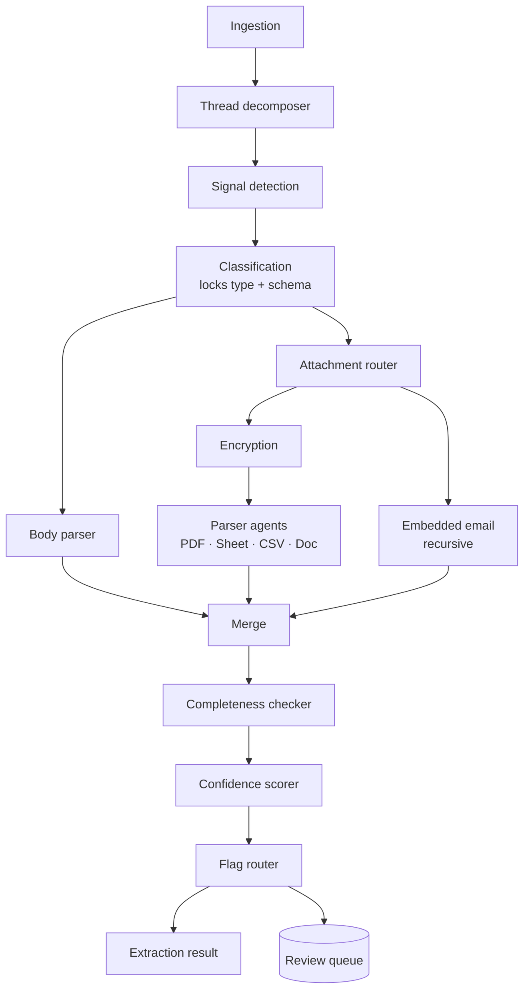
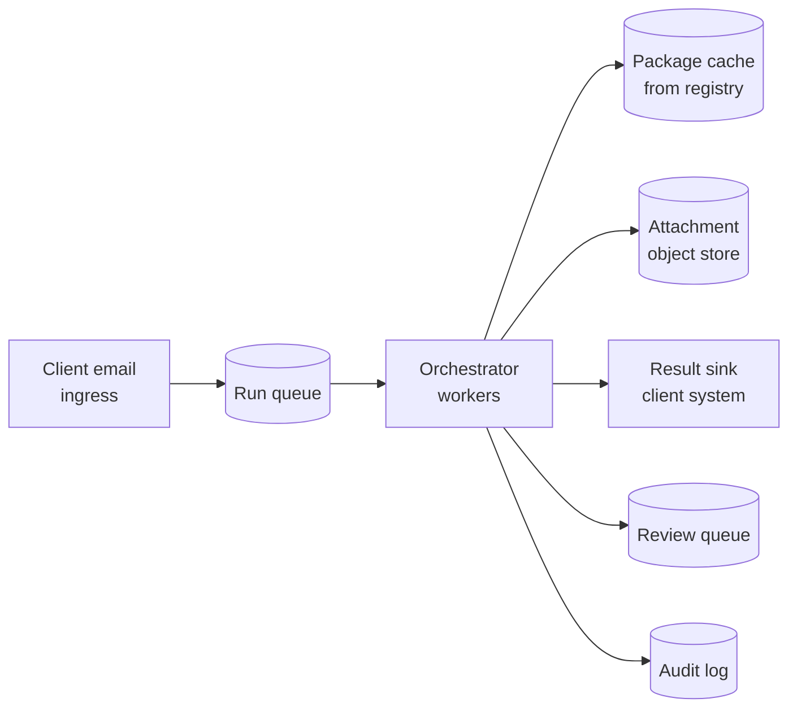

# DataExtractor PRD — Runtime Activities

2026-09-20 · Joe

Runtime takes one inbound email and produces either a structured extraction result above the client's confidence threshold or a review queue entry with machine-readable reasons — never a silent partial answer, and never a value without its source and confidence.

This is PRD 3 of 3. Output contracts and the workflow package it loads (`CTR-` IDs) are defined in **DataExtractor PRD — Shared Contracts & Artifact Store**; the artifacts it executes are authored per **DataExtractor PRD — Design-Time Activities**. Requirement IDs here use the prefix `RT-`.

## Scope and execution model

A **run** is one email processed end to end under one workflow package version. Runs are independent, idempotent by message id, and always terminal: every run ends in a result, a review entry or an error, and always writes an audit record.

| Property | Commitment |
| --- | --- |
| Unit of work | One inbound email, identified by `message_id` |
| Behaviour source | One workflow package resolved at run start; pinned for the whole run (CTR-22) |
| Terminal states | `extracted`, `review_queued`, `error` |
| Idempotency | Re-delivery of the same `message_id` returns the existing result rather than re-extracting, within the dedupe window |
| Guarantee | Every accepted field carries value, source and confidence; nothing is inferred without attribution |

| ID | Requirement | Acceptance criteria |
| --- | --- | --- |
| RT-01 | A run resolves `client_id` and `workflow_id` from the ingress route, then loads the active package version and pins it for the run. | The audit record's `package_version` matches the active version at run start even if activation changes mid-run. |
| RT-02 | No client-specific behaviour exists in engine code; all per-client behaviour comes from the package. | Adding a client requires a package only — no engine deployment, verified by onboarding a second client with no code change. |
| RT-03 | A run that cannot resolve a package fails fast with `package_unresolved` and queues the email for operations, without attempting a default extraction. | No extraction is produced under a fallback or guessed package. |
| RT-04 | Runs are idempotent by `message_id` within a configurable dedupe window (default 7 days). | Re-delivering the same email returns the original `audit_id` and does not create a second review entry. |
| RT-05 | Runtime never writes to the artifact registry and never modifies a package. | Registry access logs show read-only access from the production role. |
| RT-06 | Every run emits an audit record, including on hard failure. | Chaos test killing a worker mid-run still yields an audit record with `outcome: "error"` and the partial trace. |

## Pipeline flow

The orchestrator owns the sequence, the working memory and every escalation decision. Agents never call each other directly; they return to the orchestrator, which decides the next hop.



Classification is the fan-out point: until the email type is locked there is no schema to extract against. Merge is the only join. Everything between them runs in parallel.

| ID | Requirement | Acceptance criteria |
| --- | --- | --- |
| RT-07 | The orchestrator is the only component that sequences agents, handles escalation and terminates the run. | No agent-to-agent call appears in the trace; every hop passes through the orchestrator. |
| RT-08 | Body Parser and all attachment parser agents start only after Classification locks the type, and run concurrently from that point. | Trace timestamps show overlapping execution; a run with three attachments takes materially less than the serial sum. |
| RT-09 | Merge is the single synchronisation barrier; it starts only when every dispatched branch has returned a result or a terminal failure. | No merge executes on a partial branch set; a hung branch hits its timeout and returns a failure, which Merge records. |
| RT-10 | A branch failure degrades the run rather than killing it: the field map proceeds without that source and the reason is carried to Flag Router. | An unreadable attachment yields a review entry with `attachment_parse_failed:<filename>`, not an error outcome. |
| RT-11 | Classification is irreversible within a run; a later contradiction is recorded as a flag, not a re-classification. | A run never restarts the pipeline after Classification; contradictions surface as `classification_ambiguous`. |

## Pipeline agents

Sixteen agents, each with a declared input, output and failure mode. An agent that cannot produce its output returns a typed failure; it never returns a guess.

| Agent | Input | Output | Failure mode |
| --- | --- | --- | --- |
| Ingestion | Raw MIME bytes | Headers, body parts, attachment list | `malformed_email` → error |
| Thread Decomposer | Body string | Ordered segments with recency index | `segmentation_failed` → whole body as segment 0, flagged |
| Signal Detection | Segments + detection rules | Candidate types with scores | Below threshold → `classification_ambiguous` |
| Classification | Candidate types | Locked type + required-field schema | No type above threshold → review |
| Body Parser | Segments + schema | Tagged field map with per-value attribution | Partial map + missing list |
| Attachment Router | Attachment list | Dispatch plan per attachment | `unsupported_attachment:<mime>` per item |
| Encryption | Encrypted attachment + context | Decrypted bytes | `encrypted_no_key` → flag, run continues |
| PDF Parser | PDF bytes | Text + page map | OCR fallback; then `attachment_parse_failed` |
| Spreadsheet Parser | XLS/XLSX bytes | Selected sheet as typed cells + field map | `attachment_parse_failed` (sheet selection failure included) |
| CSV Parser | CSV bytes | Rows + column mapping + field map | `attachment_parse_failed` |
| Doc Parser | DOC/DOCX bytes | Plain text → entity extraction | `attachment_parse_failed` |
| Embedded Email | Embedded message + depth counter | Field map from the nested thread | `embedded_depth_exceeded` → flag |
| Merge | All field maps | Single field map with conflicts resolved and recorded | `critical_field_conflict:<name>` |
| Completeness Checker | Merged map + schema | Missing required fields list | — |
| Confidence Scorer | Merged map + coverage + agreement | Per-field and overall confidence | — |
| Flag Router | Scores + flags + thresholds | Terminal routing decision | — |

### Requirements

| ID | Requirement | Acceptance criteria |
| --- | --- | --- |
| RT-12 | Thread Decomposer assigns a recency index to every segment; segment 0 is the most recent. | Conflict Resolution's recency bias is reproducible from the index alone. |
| RT-13 | Classification locks both the email type and its required-field schema from the package (CTR-07) before any parsing begins. | No parser agent runs without a schema in working memory. |
| RT-14 | Attachment Router identifies type by magic bytes, not by file extension, and routes unknown types to a flag rather than a parser. | A `.xlsx` file that is actually a ZIP of CSVs is detected and handled or flagged, never mis-parsed silently. |
| RT-15 | Encryption Agent attempts decryption only with keys found in the email context via the Key Search Skill; it never brute-forces or uses a stored key list. | Audit shows the candidate key's source segment; a failure produces `encrypted_no_key` and the run continues without that attachment. |
| RT-16 | PDF Parser falls back to OCR only when the text layer is absent or below a density threshold, and records which path was used. | The audit record names `pdf_text` or `ocr` per page; OCR is not invoked on a text-layer PDF. |
| RT-17 | Spreadsheet Parser selects a sheet via the Sheet Selection Skill and records the sheet name and the reason for selection. | A multi-sheet workbook's chosen sheet and rationale appear in the audit record. |
| RT-18 | Embedded Email Agent is the only recursive agent and checks the depth counter before recursing. | At the configured limit the run flags `embedded_depth_exceeded` and continues with what it has; no unbounded recursion is reachable. |
| RT-19 | Merge resolves conflicts by the Conflict Resolution Skill and records every conflict it resolved, with both values and the winning rule. | A reviewer can see that body said 12,400 and the attachment said 12,450, and which won and why. |
| RT-20 | Merge flags rather than resolves a conflict on a critical field where the delta exceeds the package tolerance (CTR-10). | An amount difference above tolerance always reaches review, regardless of overall confidence. |
| RT-21 | Completeness Checker compares against required fields only; optional fields never force a review. | A missing optional field produces no reason code. |
| RT-22 | Confidence Scorer produces per-field and overall confidence via the Confidence Scoring Skill, using coverage, source agreement and entity certainty. | Overall confidence is reproducible from the recorded inputs; calibration is measurable against design-time metric DT-28. |
| RT-23 | Flag Router routes on package thresholds and flag conditions alone, with no hard-coded values. | Changing `accept_at` in a package changes routing with no deployment. |

## Skills and tools

The layer boundary is the architecture's central rule and runtime enforces it: agents call skills for judgment, skills call tools for mechanical work, and tools never reason. Keeping deterministic work in tools is what makes cost, latency and reproducibility predictable.

| Layer | Invoked by | May call | Deterministic |
| --- | --- | --- | --- |
| Agent | Orchestrator | Skills, and tools for purely mechanical steps | No |
| Skill | Agents listed in its manifest | Tools listed in its manifest | No |
| Tool | Skills and agents | Nothing | Yes — same input, same output |

**Skills** — Entity Extraction, Sheet Selection, Field Mapping, Confidence Scoring, Conflict Resolution, Key Search, Signal Detection. Each resolves from the package if overridden, otherwise from the engine default.

**Tools** — MIME Parser, Thread Segmenter, Regex Tool, NER Tool, OCR Tool, PDF Text Tool, Spreadsheet Reader, CSV Reader, DOC Text Tool, File Type Detector, Decryption Tool, Field Schema Lookup, Source Attribution Tracker.

| ID | Requirement | Acceptance criteria |
| --- | --- | --- |
| RT-24 | A skill is invocable only by the agents in its manifest's `bound_agents`, and may call only the tools in its `tools` list. | An out-of-manifest invocation or tool call is refused at runtime and logged as `skill_binding_violation`. |
| RT-25 | Skill resolution order is package override, then engine default; the choice is recorded per invocation as `skill_source`. | Every judgment step in the audit record names the skill id, version and source. |
| RT-26 | Every skill invocation respects its manifest `token_budget` and `timeout_ms`. | Exceeding either returns a typed failure to the orchestrator; it never truncates output silently. |
| RT-27 | Tools are pure: identical input produces identical output, with no hidden state and no model call. | A tool replay test over a fixed corpus produces byte-identical output across runs and hosts. |
| RT-28 | Source Attribution Tracker attaches `(source, segment_index, confidence)` to every extracted value at the moment of extraction, not afterwards. | No value reaches Merge without attribution; a value lacking it fails validation. |
| RT-29 | Tool failures are typed and distinguishable as transient or permanent for the Retry Controller. | An S3 read timeout retries; a corrupt-file error does not. |
| RT-30 | A skill's output is schema-validated against its manifest `outputs` before the orchestrator accepts it. | Malformed skill output is a typed failure, never a partially trusted field map. |

## Memory and state

Working memory is the run's only shared mutable state. It is serialisable at every agent boundary, which is what makes the pipeline resumable and the audit record complete.

```json
{
  "run_id": "run_abc123",
  "package": { "client_id": "acme", "workflow_id": "ap-invoices", "version": "1.4.0" },
  "email": { "message_id": "<c8f2@acme.example>", "received_at": "2026-09-20T09:12:31Z" },
  "segments": [{ "index": 0, "chars": 1840 }, { "index": 1, "chars": 620 }],
  "classification": { "type": "invoice", "score": 0.74, "locked_at_ms": 652 },
  "schema_ref": "schemas/invoice.json",
  "field_map": {
    "amount": [ { "value": 12400.00, "source": "body:segment_0", "confidence": 0.88 },
                { "value": 12450.00, "source": "attachment:inv.xlsx!Summary!B14", "confidence": 0.93 } ]
  },
  "missing_fields": ["due_date"],
  "attachments": [{ "name": "inv.xlsx", "mime": "application/vnd.openxml…", "status": "parsed" }],
  "depth": 0,
  "flags": ["critical_field_conflict:amount"],
  "checkpoint": "merge"
}
```

Before Merge, `field_map` holds every candidate per field; after Merge it holds one resolved value per field plus a conflict log. That shape change is what lets Merge be the only place a value is chosen.

| Store | Contents | Lifetime |
| --- | --- | --- |
| Working memory | The object above | Run duration + checkpoint retention |
| Field Schema Store | Per-type required/optional fields and validation, from the package | Package lifetime, read-only |
| Detection Rules Store | Keywords, patterns, entity weights, from the package | Package lifetime, read-only |
| Review Queue | Flagged runs with partial data and reason codes | 90 days after resolution (CTR-30) |
| Audit Log | Immutable per-run decision and attribution record | 7 years (CTR-29) |

| ID | Requirement | Acceptance criteria |
| --- | --- | --- |
| RT-31 | Working memory is fully serialisable at every agent boundary. | A run resumed from a serialised checkpoint on a different worker produces the same terminal output. |
| RT-32 | Pre-merge, every field holds all candidate values with attribution; no candidate is discarded before Merge. | The audit record can show every candidate the run saw, including losers. |
| RT-33 | The Field Schema and Detection Rules stores are read-only projections of the pinned package. | No run mutates them; a package switch does not affect a run already in flight. |
| RT-34 | Raw email bodies and attachment bytes are referenced, not copied, into working memory. | Checkpoint size stays bounded regardless of attachment size. |
| RT-35 | Working memory checkpoints are encrypted at rest and deleted within the configured retention window after the run terminates. | Checkpoint store shows no records older than the window; deletion is logged. |

## Infrastructure controllers

Five controllers keep the pipeline bounded. They are engine-level, configured per package where the architecture allows it, and every intervention they make appears in the audit record.

| Controller | Rule | Configurable |
| --- | --- | --- |
| Depth Tracker | Integer in working memory; Embedded Email Agent checks before recursing, halts at the limit and flags | Max depth per package, default 3 |
| Retry Controller | Per-agent retry with exponential backoff; transient retries, permanent flags immediately | Attempts and backoff per agent class |
| Timeout Manager | Per-agent time budget; OCR and PDF get longer budgets than entity extraction or schema lookup | Per-agent budgets, engine defaults |
| Context Serializer | Serialises working memory between hops; run resumes from last successful checkpoint | Checkpoint frequency |
| Concurrency Controller | Body Parser and attachment parsers run in parallel after Classification; Merge is the join | Max parallel branches per run |

| ID | Requirement | Acceptance criteria |
| --- | --- | --- |
| RT-36 | Recursion depth is checked before, not after, recursing. | A depth-limit test never executes a nested run beyond the limit; the flag appears at the boundary. |
| RT-37 | The Retry Controller distinguishes transient from permanent failures by the typed error from the tool or skill, never by string matching. | A permanent failure is never retried; retry counts per agent appear in the audit record. |
| RT-38 | Retries are bounded per agent and per run; exhausting them flags rather than fails the run where a partial result is still useful. | A parser that exhausts retries produces `attachment_parse_failed`, and the run reaches review with the body-derived fields intact. |
| RT-39 | Every agent executes under a timeout; expiry is a typed failure, not a hang. | No run exceeds the run-level ceiling; a deliberately stalled tool produces `agent_timeout:<agent>`. |
| RT-40 | A run interrupted by worker loss resumes from the last checkpoint rather than restarting. | Killing a worker mid-parse resumes and completes without re-running completed agents. |
| RT-41 | Parallel branches are bounded per run; a message with many attachments queues branches rather than exhausting the worker. | A 50-attachment email completes within the run ceiling without resource exhaustion. |
| RT-42 | Every controller intervention — retry, timeout, depth halt, resume — is recorded in the audit record. | Operations can answer why a run was slow or degraded from the audit record alone. |

## Output routing and the review queue

Flag Router makes the only irreversible decision in the run. Everything it needs comes from the package thresholds; the code contributes no judgment of its own.

**Routing rules, in order**

1. Any condition in `always_review_if` is present → review.
2. Any required field missing → review, with `missing_field:<name>`.
3. Any critical-field conflict beyond tolerance → review, with `critical_field_conflict:<name>`.
4. Overall confidence below `reject_below` → review, with `low_confidence`.
5. Overall confidence below `accept_at` → review, with `low_confidence`.
6. Otherwise → extraction result.

| ID | Requirement | Acceptance criteria |
| --- | --- | --- |
| RT-43 | Routing rules evaluate in a fixed order and accumulate all applicable reason codes, not just the first. | A run missing a field and holding a conflict shows both codes. |
| RT-44 | A review entry carries every partial field extracted, with attribution, so the reviewer starts from evidence rather than from the raw email. | No review entry is emitted with an empty `partial_fields` when any field was extracted. |
| RT-45 | Reason codes come from the closed vocabulary in CTR-16; free text never appears in `review_reason`. | Schema validation rejects an unknown code; CI fails on a new code added without a vocabulary update. |
| RT-46 | A reviewer's correction is recorded against the `audit_id` with the original value, the corrected value and the reviewer's identity. | Correction history per workflow is queryable, and is the export path into a new design-time corpus version (DT-39). |
| RT-47 | Resolving a review entry emits an extraction result carrying the same `audit_id`, marked `human_corrected`. | Downstream consumers receive one result per email whether or not it passed through review. |
| RT-48 | Corrections never modify the package or any artifact at runtime (CTR-01, RT-05). | Registry shows no writes from the review path. |

**Reviewer workflow.** Queue entry → reviewer sees partial fields with sources, the original email and attachments, and the reason codes → reviewer corrects or rejects → corrected result is emitted and the correction is logged. Queue prioritisation and SLA targets are an operations concern and are not specified here.

## AWS production deployment and operations

Production is a separate AWS account from UAT, reachable from design-time only through package promotion. Email arrives per client on a dedicated ingress route, which is what resolves `client_id` and `workflow_id`.



| ID | Requirement | Acceptance criteria |
| --- | --- | --- |
| RT-49 | Inbound email lands on a durable queue before processing; nothing is processed in the ingress path. | An extraction outage delays processing but loses no email; queue depth is the backpressure signal. |
| RT-50 | Each client's email, attachments, results, review entries and audit records are isolated by client-scoped roles and keys. | No cross-client read path exists; an isolation test fails the build if one appears. |
| RT-51 | Attachments are stored encrypted, referenced by run, and deleted per the client's retention policy. | Retention job removes attachment bytes on schedule while audit records persist. |
| RT-52 | Package activation and rollback (CTR-20) take effect without an engine deployment. | A rollback drill completes within 5 minutes with no deployment pipeline involved. |
| RT-53 | Engine deployments are staged and reversible; every promoted package is re-evaluated against a new engine version before it is rolled out (PRD 2, re-design triggers). | No engine rollout proceeds with an unevaluated package in production. |
| RT-54 | Per-client metrics are emitted continuously: throughput, review rate, terminal-state mix, p50/p95 latency, cost per email, per-agent failure rate. | A sustained review-rate rise triggers an alert and is the re-design trigger named in PRD 2. |
| RT-55 | Any run is reconstructable from its `audit_id`: package version, engine version, agent trace and field attribution. | Support can explain any single extracted value without access to the original mailbox. |
| RT-56 | A poison message cannot block the queue: repeated hard failures move the email to a dead-letter path with an audit record. | A malformed email fails once, is dead-lettered, and processing continues. |

## Non-functional requirements

| ID | Requirement | Target |
| --- | --- | --- |
| RT-57 | Latency, body-only email | p50 ≤ 8 s, p95 ≤ 20 s from dequeue to terminal state |
| RT-58 | Latency, email with up to 3 CSV/XLSX attachments | p50 ≤ 25 s, p95 ≤ 60 s |
| RT-59 | Latency, email requiring OCR | p95 ≤ 180 s; OCR runs under its own extended budget |
| RT-60 | Run ceiling | 300 s hard cap; exceeding it terminates with `agent_timeout` and routes to review |
| RT-61 | Throughput | 1,000 emails/hour per client sustained, horizontally scalable by worker count |
| RT-62 | Cost | Reported per email and per client; a run's projected cost above the configured ceiling routes to review rather than continuing |
| RT-63 | Availability | 99.5% monthly for the processing path; queue durability independent of it |
| RT-64 | Correctness under load | No degradation of extraction output under concurrency; identical input yields identical output regardless of load |
| RT-65 | Security | Attachment parsing runs sandboxed with no outbound network; a malicious file cannot reach the registry, the queue or another client's data |
| RT-66 | Data minimisation | Email content and attachment bytes are never written to logs or traces; only ids, field names and confidences are logged |
| RT-67 | Audit completeness | 100% of runs produce an audit record; a gap is a P1 defect |

RT-65 deserves emphasis: the pipeline opens untrusted files from external senders on every run. Sandboxing the parser agents is a security control, not a performance one, and it constrains how PDF, DOC and archive handling are built in Phase 2.

## Phase 1 (PoC)

One workflow, CSV and Excel attachments, run locally against a fixed set of emails. The purpose is to prove the layer boundaries and the output contract, not throughput.

| Component | Phase 1 | Deferred to Phase 2 |
| --- | --- | --- |
| Orchestrator | Yes, single-process | Distributed workers, queue-driven ingress |
| Ingestion, Thread Decomposer, Signal Detection, Classification | Yes | — |
| Body Parser, Completeness Checker, Merge, Confidence Scorer, Flag Router | Yes | — |
| Attachment Router | Yes, magic-byte detection for CSV/XLSX | All other types |
| CSV Parser, Spreadsheet Parser | Yes | — |
| PDF Parser, Doc Parser, OCR | No | Phase 2 |
| Encryption Agent, Key Search Skill | No — encrypted attachments flag immediately | Phase 2 |
| Embedded Email Agent | No — embedded messages flag immediately | Phase 2 |
| Skills | Field Mapping, Sheet Selection, Conflict Resolution, Confidence Scoring, Signal Detection | Entity Extraction override, Key Search |
| Controllers | Timeout, Retry, Depth (as a guard that flags) | Context Serializer checkpointing, Concurrency Controller |
| Review queue | Local JSON store with the CTR contract | Managed queue, reviewer UI, correction export |
| Audit log | Local append-only file with the CTR contract | Immutable managed store, 7-year retention |

**Phase 1 acceptance criteria**

- [ ] An email with one CSV and one XLSX attachment produces a schema-valid extraction result with every field carrying value, source and confidence.
- [ ] A source string resolves to a specific row or cell (`attachment:inv.xlsx!Summary!B14`) and a reviewer can verify it by opening the file.
- [ ] An email with a deliberately missing required field produces a review entry with `missing_field:<name>` and the partial fields intact.
- [ ] A conflict between the body amount and the attachment amount beyond tolerance produces `critical_field_conflict:amount` and both candidate values in the audit record.
- [ ] An encrypted attachment produces `encrypted_no_key` and the run still completes with body-derived fields.
- [ ] Changing `accept_at` in the package changes the routing of a borderline email with no code change (RT-23).
- [ ] The audit record for every run names the package version, each agent's duration and status, and the skill version for every judgment step.
- [ ] Replaying the same email twice produces identical output (RT-64 at n=1).

**Deliberately excluded from Phase 1:** AWS deployment, queue ingress, parallel branch execution, checkpoint resume, sandboxing, cost reporting, and every attachment type other than CSV and XLSX.

## Open questions

- [ ] **Result delivery.** How does the extraction result reach the client's finance system — webhook, queue, API pull, file drop? This changes the contract at the far edge and the retry semantics for delivery.
- [ ] **Review ownership.** Is the review queue staffed by the client or by the delivery team? It decides whether the reviewer UI is a product surface or an internal tool, and whether SLA targets belong in this PRD.
- [ ] **Duplicate and follow-up emails.** A corrected invoice arriving as a reply in the same thread is a new run today. Should runtime detect supersession, or is that a downstream concern?
- [ ] **Confidence calibration in production.** DT-28 measures calibration at design time. Production calibration drifts; decide whether runtime samples outcomes for re-measurement and what that sampling costs.
- [ ] **Run ceiling versus OCR.** RT-60's 300 s cap and RT-59's 180 s OCR p95 leave little headroom for a multi-page scanned PDF with other attachments. Confirm both once PDF handling is scoped.
- [ ] **Model version drift.** Skills are model-backed. A model upgrade can change extraction behaviour with no package change; the pinning decision raised in PRD 2 applies here and needs resolving before production.
